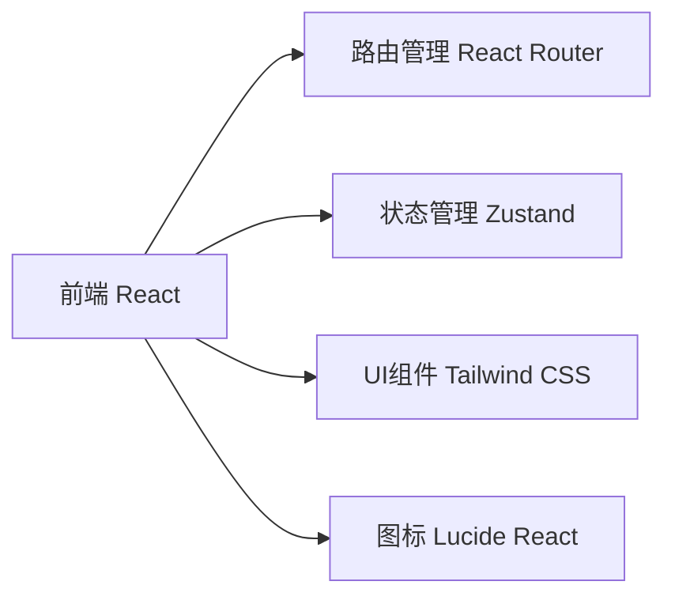

## 1. Architecture Design

## 2. Technology Description
- Frontend: React@18 + tailwindcss@3 + vite
- Initialization Tool: vite-init
- Backend: None (纯前端官网)
- Database: None

## 3. Route Definitions
| Route | Purpose |
|-------|---------|
| / | 首页 |
| /about | 关于我们 |
| /solutions | 解决方案 |
| /contact | 联系我们 |

## 4. API Definitions
无需后端API

## 5. Server Architecture Diagram
无需后端

## 6. Data Model
无需数据模型

