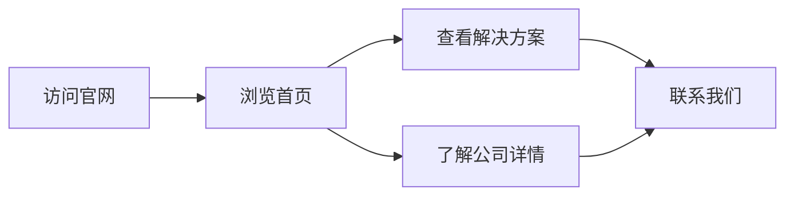

## 1. Product Overview
宁波感叹号科技有限公司官网，展示公司形象、业务范围和数字化工厂解决方案。
- 目标：向客户展示公司专业形象，吸引潜在客户，建立品牌认知度
- 目标用户：制造业企业决策者、技术负责人

## 2. Core Features

### 2.2 Feature Module
1. **首页**：英雄区域、导航栏、关于我们、业务范围、解决方案展示、客户案例、联系我们
2. **关于我们**：公司简介、发展历程、团队介绍
3. **解决方案**：数字化工厂整体解决方案详情
4. **联系我们**：联系方式、在线留言表单

### 2.3 Page Details
| Page Name | Module Name | Feature description |
|-----------|-------------|---------------------|
| 首页 | 英雄区域 | 全屏背景图，公司标语，CTA按钮 |
| 首页 | 导航栏 | 固定顶部导航，响应式菜单 |
| 首页 | 关于我们 | 公司简介卡片 |
| 首页 | 业务范围 | 图标+文字展示核心业务 |
| 首页 | 解决方案 | 卡片式展示MES、WMS、QMS、EMS等系统 |
| 首页 | 客户案例 | 轮播图展示成功案例 |
| 首页 | 联系我们 | 联系信息和地图 |
| 首页 | 页脚 | 导航链接、版权信息 |
| 关于我们 | 公司简介 | 详细介绍公司情况 |
| 关于我们 | 发展历程 | 时间轴展示发展历史 |
| 关于我们 | 团队介绍 | 核心团队成员展示 |
| 解决方案 | MES系统 | 详细介绍制造执行系统 |
| 解决方案 | WMS系统 | 详细介绍仓储管理系统 |
| 解决方案 | QMS系统 | 详细介绍质量管理系统 |
| 解决方案 | EMS系统 | 详细介绍设备管理系统 |
| 联系我们 | 联系方式 | 电话、邮箱、地址信息 |
| 联系我们 | 在线留言 | 表单提交功能 |

## 3. Core Process
用户访问官网 → 浏览首页了解公司 → 查看解决方案 → 了解公司详细信息 → 联系我们

## 4. User Interface Design
### 4.1 Design Style
- 主色调：深蓝色 (#0f172a)、蓝色 (#3b82f6)、橙色 (#f97316)
- 按钮风格：圆角、渐变背景、悬停效果
- 字体：Noto Sans SC 中文字体，Roboto 英文字体
- 布局风格：卡片式、响应式网格布局
- 图标风格：简洁现代的线性图标

### 4.2 Page Design Overview
| Page Name | Module Name | UI Elements |
|-----------|-------------|-------------|
| 首页 | 英雄区域 | 全屏渐变背景，大标题，动画效果 |
| 首页 | 导航栏 | 固定顶部，半透明背景，响应式菜单 |
| 首页 | 业务范围 | 卡片式布局，图标+文字，悬停动画 |
| 首页 | 解决方案 | 卡片式展示，图标+详情，渐变边框 |
| 首页 | 客户案例 | 轮播图，卡片式案例展示 |
| 首页 | 联系我们 | 地图占位，联系卡片 |
| 关于我们 | 发展历程 | 时间轴样式 |
| 解决方案 | 系统详情 | 大图+文字说明 |
| 联系我们 | 在线留言 | 表单，提交按钮 |

### 4.3 Responsiveness
Desktop-first, mobile-adaptive, touch optimization

