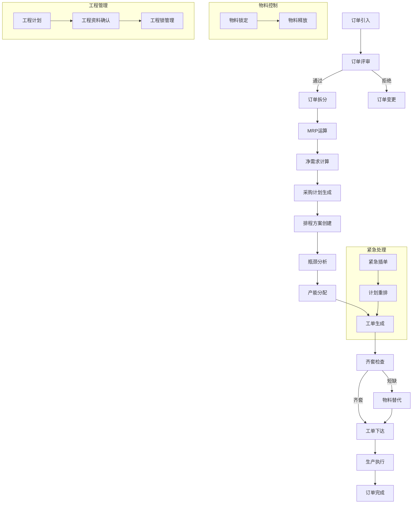
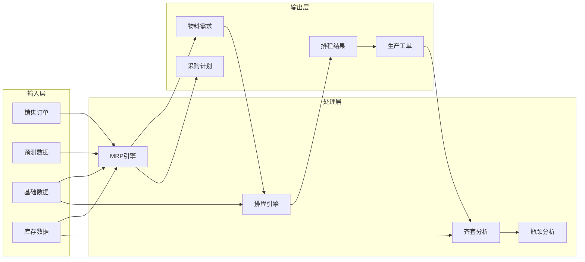

# APS高级计划与排程系统 - 核心流程详细说明

## 一、基础数据管理模块（流程①-⑧）

---

### ① 基础数据管理流程

**流程目的**：统一管理系统运行所需的各类基础数据，确保数据完整性和准确性

**流程步骤**：
1. 数据录入/导入：通过界面或批量导入工具录入数据
2. 数据校验：系统自动校验数据格式和业务规则
3. 数据审核：管理员审核数据准确性
4. 数据发布：审核通过后数据生效
5. 数据维护：定期更新和维护

**涉及数据表**：
- `material`（物料）、`customer`（客户）、`warehouse`（仓库）、`resource`（资源）
- `calendar_plan`（日历）、`operation`（工序）

**输出结果**：完整的基础数据字典

---

### ② 日历方案管理流程

**流程目的**：管理生产日历，定义工作日、休息日、节假日及班次安排

**流程步骤**：
1. 创建日历方案：定义日历编码、名称、生效日期
2. 设置工作日：配置每周工作日（周一至周日）
3. 设置班次：定义早班、中班、晚班等班次时间
4. 设置节假日：录入法定节假日和工厂休假日
5. 关联资源：将日历分配给工作中心/设备

**涉及数据表**：`calendar_plan`、`resource`

**输出结果**：
```json
{
  "code": "CAL001",
  "name": "标准工作日历",
  "workDays": {"1": true, "2": true, "3": true, "4": true, "5": true, "6": false, "7": false},
  "shiftPatterns": [{"start": "08:00", "end": "12:00"}, {"start": "13:30", "end": "17:30"}],
  "holidays": ["2024-01-01", "2024-05-01"]
}
```

---

### ③ 物料信息引入流程

**流程目的**：将物料主数据引入系统，建立物料档案

**流程步骤**：
1. 物料编码生成：自动或手动生成唯一编码
2. 物料属性录入：名称、类型、单位、成本、安全库存等
3. BOM层级设置：定义物料在BOM中的层级
4. 提前期设置：采购/生产提前期
5. 审核发布：经过审核后物料生效

**涉及数据表**：`material`、`warehouse`

**物料类型**：
- `RAW`：原材料
- `SEMI`：半成品
- `FINISHED`：成品

---

### ④ BOM引入流程

**流程目的**：建立产品物料清单，定义产品结构

**流程步骤**：
1. 选择父物料：确定要建立BOM的成品/半成品
2. 添加子物料：录入组成该物料的下级物料
3. 设置用量：定义每个子物料的用量和损耗率
4. 设置替代料：配置备选物料及其优先级
5. 版本管理：设置BOM版本和生效日期
6. 审核发布：BOM数据审核通过后生效

**涉及数据表**：`bom`、`material`

**输出示例**：
```json
{
  "parentMaterial": "产品A",
  "children": [
    {"material": "半成品A1", "quantity": 1, "scrapRate": 0.05},
    {"material": "部件B", "quantity": 2, "scrapRate": 0.02}
  ],
  "version": "V1.0"
}
```

---

### ⑤ 客户信息引入流程

**流程目的**：建立客户档案，管理客户基本信息

**流程步骤**：
1. 客户编码生成：自动生成客户编号
2. 基本信息录入：名称、联系人、联系方式
3. 财务信息录入：付款方式、信用额度
4. 审核激活：审核通过后客户状态变为活跃

**涉及数据表**：`customer`

**输出结果**：客户主数据档案

---

### ⑥ 子库引入流程

**流程目的**：建立仓库/子库档案，管理库存存储位置

**流程步骤**：
1. 仓库编码生成：自动生成仓库编号
2. 仓库信息录入：名称、类型、地址、容量
3. 层级设置：设置父子仓库关系
4. 启用状态：设置仓库是否启用

**涉及数据表**：`warehouse`

**仓库类型**：
- `RAW`：原材料仓
- `WIP`：在制品仓
- `FINISHED`：成品仓

---

### ⑦ 计划资源流程

**流程目的**：管理生产资源，包括工作中心、设备、人员等

**流程步骤**：
1. 资源分类：工作中心、机器设备、人员
2. 资源信息录入：编码、名称、类型、产能
3. 效率参数设置：效率系数、利用率、小时成本
4. 日历关联：关联工作日历

**涉及数据表**：`resource`、`calendar_plan`

**资源类型**：
- `WORKCENTER`：工作中心
- `MACHINE`：机器设备
- `WORKER`：工作人员

---

### ⑧ 工程资料引入流程

**流程目的**：管理产品工程图纸、工艺文件等技术资料

**流程步骤**：
1. 资料编号生成：自动生成资料编号
2. 资料信息录入：标题、类型、版本
3. 文件上传：上传图纸、工艺文件
4. 审批确认：工程人员审核确认

**涉及数据表**：`engineering_document`

**资料类型**：
- `DRAWING`：图纸
- `SPEC`：规格书
- `PROCESS`：工艺文件
- `BOM`：物料清单

---

## 二、订单管理模块（流程⑨、⑬-⑰）

---

### ⑨ 订单引入流程

**流程目的**：将销售订单引入系统，作为生产计划的源头

**流程步骤**：
1. 订单来源：手工录入或从ERP系统导入
2. 订单信息录入：客户、物料、数量、需求日期
3. 订单类型区分：销售订单、预测订单、补投订单
4. 优先级设置：1-10级优先级
5. 订单审核：业务人员审核订单有效性

**涉及数据表**：`sales_order`、`customer`、`material`

**订单状态流转**：
```
PENDING（待评审）→ APPROVED（已评审）→ IN_PROGRESS（执行中）→ COMPLETED（已完成）
```

---

### ⑬ 订单拆分管理流程

**流程目的**：将大订单拆分为多个小订单，便于生产组织

**流程触发条件**：
- 订单数量过大，需要分批生产
- 需求日期需要分段交付
- 生产能力限制

**流程步骤**：
1. 选择订单：选择需要拆分的订单
2. 设置拆分规则：按数量或按日期拆分
3. 拆分执行：系统自动生成拆分订单
4. 拆分确认：确认拆分结果

**涉及数据表**：`order_split`、`sales_order`

**输出示例**：
```json
{
  "originalOrder": "SO2024001",
  "splits": [
    {"splitOrder": "SO2024001-001", "quantity": 50, "demandDate": "2024-01-15"},
    {"splitOrder": "SO2024001-002", "quantity": 50, "demandDate": "2024-01-20"}
  ]
}
```

---

### ⑭ 订单评审管理流程

**流程目的**：对订单进行可行性评审，确保订单可执行

**流程步骤**：
1. 订单接收：新订单进入待评审队列
2. 能力评估：评估产能是否满足需求
3. 物料检查：检查关键物料是否可用
4. 交期确认：确认是否能满足需求日期
5. 评审决策：通过/拒绝/条件通过
6. 结果通知：通知业务部门评审结果

**涉及数据表**：`sales_order`

**评审状态**：
- `PENDING`：待评审
- `APPROVED`：已通过
- `REJECTED`：已拒绝

---

### ⑮ 合同变更管理流程

**流程目的**：处理销售合同的变更请求

**流程触发条件**：
- 客户提出合同修改
- 市场条件变化
- 公司政策调整

**流程步骤**：
1. 变更申请：接收变更请求
2. 影响评估：评估变更对生产计划的影响
3. 成本核算：计算变更带来的成本变化
4. 审批流程：逐级审批变更申请
5. 合同更新：更新合同信息
6. 计划调整：调整相关生产计划

**涉及数据表**：`order_change`、`sales_order`

---

### ⑯ 订单变更管理流程

**流程目的**：处理订单内容的变更

**流程步骤**：
1. 变更申请：填写变更单（数量、日期、优先级）
2. 变更原因：说明变更原因
3. 影响分析：分析对MRP、排程、工单的影响
4. 审批确认：审批变更申请
5. 执行变更：更新订单数据
6. 计划重算：触发MRP重新计算

**涉及数据表**：`order_change`、`sales_order`

**变更类型**：
- `QUANTITY`：数量变更
- `DATE`：日期变更
- `PRIORITY`：优先级变更
- `CANCEL`：订单取消

---

### ⑰ 补投单导入管理流程

**流程目的**：处理需要追加生产的补投订单

**流程触发条件**：
- 订单数量不足需要补投
- 质量问题导致返工
- 客户追加订单

**流程步骤**：
1. 补投原因录入：说明补投原因
2. 关联原订单：关联到原始销售订单
3. 数量确认：确认补投数量
4. 审批流程：审核补投申请
5. 生成订单：创建补投订单

**涉及数据表**：`replenishment_order`、`sales_order`

---

## 三、工程计划模块（流程⑩-⑫）

---

### ⑩ 工程计划管理流程

**流程目的**：制定新产品或改进产品的工程计划

**流程步骤**：
1. 计划创建：定义计划编号、版本
2. 物料关联：关联需要变更的物料
3. 时间安排：设定计划开始和结束时间
4. 任务分解：分解工程任务
5. 执行跟踪：跟踪计划执行进度

**涉及数据表**：`engineering_plan`

**计划状态**：
- `DRAFT`：草稿
- `CONFIRMED`：已确认
- `LOCKED`：已锁定

---

### ⑪ 工程资料确认流程

**流程目的**：确认工程资料的准确性和有效性

**流程步骤**：
1. 资料提交：提交待确认的工程资料
2. 技术审核：工程师审核技术内容
3. 标准化检查：检查是否符合企业标准
4. 版本确认：确认版本号
5. 正式发布：确认后正式发布

**涉及数据表**：`engineering_document`

---

### ⑫ 复投单工程锁管理流程

**流程目的**：对需要重复投入生产的产品进行工程锁定，防止错误生产

**流程触发条件**：
- 产品设计变更
- 质量问题需要追溯
- 工艺改进

**流程步骤**：
1. 锁定申请：申请对物料进行工程锁定
2. 锁定原因：说明锁定原因
3. 审批流程：审批锁定申请
4. 执行锁定：设置物料锁定状态
5. 解锁管理：在合适时机解除锁定

**涉及数据表**：`engineering_lock`、`material`

**锁定类型**：
- `REPEAT_LOCK`：复投锁定
- `ENGINEERING_LOCK`：工程锁定

---

## 四、MRP计算模块（流程⑱、㊲）

---

### ⑱ 净需求计算管理流程

**流程目的**：计算物料的净需求量，为采购和生产提供依据

**计算公式**：
```
净需求 = 毛需求 - 可用库存 - 计划接收 + 安全库存
```

**流程步骤**：
1. 收集需求：收集销售订单、预测订单、工单需求
2. 计算毛需求：根据BOM展开计算各物料需求量
3. 获取库存：获取当前库存和已分配量
4. 计算净需求：应用公式计算净需求
5. 批量调整：考虑最小批量、最大批量规则
6. 生成建议：生成采购/生产建议订单

**涉及数据表**：`net_requirement`、`inventory`、`material_requirement`

**输出示例**：
```json
{
  "materialId": "M001",
  "grossRequirement": 200,
  "onHandQuantity": 50,
  "safetyStock": 20,
  "netRequirement": 170,
  "orderSuggestion": 200,
  "requiredDate": "2024-01-20"
}
```

---

### ㊲ MRP流程

**流程目的**：执行完整的物料需求计划运算

**流程步骤**：
1. 参数设置：设置计划期开始和结束日期
2. 数据准备：收集所有需求来源
3. BOM展开：从成品到原材料逐层展开
4. 净需求计算：计算每一层物料的净需求
5. 计划订单生成：生成采购计划和生产计划
6. 结果输出：生成MRP报告

**涉及数据表**：`mrp_run`、`net_requirement`、`purchase_plan`

**MRP运行状态**：
- `RUNNING`：运行中
- `COMPLETED`：已完成
- `FAILED`：失败

---

## 五、排程管理模块（流程⑲-㉓）

---

### ⑲ 排程方案管理流程

**流程目的**：创建和管理生产排程方案

**流程步骤**：
1. 创建方案：定义方案名称、计划期
2. 选择算法：正向排程/逆向排程/有限产能排程
3. 设置优化目标：最小化完工时间/最小化延迟/负载均衡
4. 执行排程：运行排程算法
5. 方案保存：保存排程方案

**涉及数据表**：`scheduling_plan`、`scheduling_result`

**排程算法**：
- `FORWARD`：正向排程（从当前时间开始）
- `BACKWARD`：逆向排程（从交货期倒推）
- `FINITE_CAPACITY`：有限产能排程

**优化目标**：
- `MIN_MAKESPAN`：最小化完工时间
- `MIN_DELAY`：最小化延迟
- `BALANCE_LOAD`：负载均衡

---

### ⑳ 瓶颈工序分布计算流程

**流程目的**：识别生产系统中的瓶颈工序

**识别标准**：
- 资源利用率 > 85%
- 队列长度 > 10
- 平均等待时间过长

**流程步骤**：
1. 数据采集：收集各工作中心的生产数据
2. 利用率计算：计算每个工作中心的利用率
3. 队列分析：分析各工序的排队情况
4. 瓶颈判定：根据阈值判定瓶颈
5. 生成报告：输出瓶颈分析报告和优化建议

**涉及数据表**：`bottleneck_analysis`、`resource`、`operation`

**输出示例**：
```json
{
  "workcenterId": "WC001",
  "utilizationRate": 0.92,
  "queueLength": 15,
  "avgWaitTime": 2.5,
  "isBottleneck": true,
  "recommendations": "建议增加产能或优化生产计划"
}
```

---

### ㉑ 产能分配流程

**流程目的**：合理分配有限的生产能力

**流程步骤**：
1. 产能评估：评估各资源的可用产能
2. 需求收集：收集所有订单的产能需求
3. 优先级排序：按订单优先级排序
4. 产能分配：按优先级分配产能
5. 冲突处理：处理产能冲突
6. 结果确认：确认分配结果

**涉及数据表**：`resource`、`scheduling_result`

---

### ㉒ 紧急插单管理流程

**流程目的**：处理紧急订单的插入，优先满足紧急需求

**流程触发条件**：
- 客户紧急需求
- 订单优先级提升为最高
- 特殊订单处理

**流程步骤**：
1. 插单申请：提交紧急插单申请
2. 影响评估：评估对现有计划的影响
3. 自动审批：紧急插单可自动通过
4. 计划重排：重新执行排程
5. 通知相关方：通知受影响的订单负责人

**涉及数据表**：`order_insertion`、`sales_order`、`scheduling_result`

---

### ㉓ 强制插单管理流程

**流程目的**：强制插入订单，需要人工审批

**流程步骤**：
1. 插单申请：提交强制插单申请
2. 影响分析：详细分析对现有计划的影响
3. 人工审批：需要管理层审批
4. 计划调整：调整生产计划
5. 执行跟踪：跟踪插单执行情况

**涉及数据表**：`order_insertion`、`sales_order`

---

## 六、工单管理模块（流程㉔-㉗）

---

### ㉔ 计划单导入流程

**流程目的**：将计划订单导入系统

**流程步骤**：
1. 数据准备：准备计划单数据
2. 数据导入：批量导入计划单
3. 数据校验：校验数据完整性
4. 确认导入：确认导入结果

**涉及数据表**：`work_order`

---

### ㉕ 计划单锁定管理流程

**流程目的**：锁定计划单，防止被修改

**流程触发条件**：
- 计划已确认执行
- 需要保护关键计划
- 审计要求

**流程步骤**：
1. 锁定申请：申请锁定计划单
2. 锁定原因：说明锁定原因
3. 执行锁定：设置锁定状态
4. 解锁管理：在合适时机解锁

**涉及数据表**：`work_order`

---

### ㉖ 工单拆分管理流程

**流程目的**：将工单拆分为多个子工单

**流程触发条件**：
- 工单数量过大
- 需要在不同工作中心执行
- 需要分批完成

**流程步骤**：
1. 选择工单：选择需要拆分的工单
2. 设置拆分规则：按数量或按工序拆分
3. 执行拆分：生成子工单
4. 确认拆分：确认拆分结果

**涉及数据表**：`work_order_split`、`work_order`

---

### ㉗ 工单下达管理流程

**流程目的**：将工单下达至生产车间

**流程步骤**：
1. 齐套检查：检查物料是否齐全
2. 产能确认：确认工作中心有产能
3. 工单打印：打印工单发至车间
4. 状态更新：更新工单状态为已下达
5. 通知车间：通知相关生产人员

**涉及数据表**：`work_order`

**工单状态流转**：
```
PLANNING（计划中）→ RELEASED（已下达）→ IN_PROGRESS（执行中）→ COMPLETED（已完成）→ CLOSED（已关闭）
```

---

## 七、物料需求模块（流程㉘-㉞）

---

### ㉘ 待评审物料需求流程

**流程目的**：处理待评审的物料需求

**流程步骤**：
1. 需求收集：收集待评审的物料需求
2. 需求分析：分析需求的合理性
3. 审批流程：审批物料需求
4. 需求确认：确认后需求生效

**涉及数据表**：`material_requirement`

---

### ㉙ 预测物料需求流程

**流程目的**：根据销售预测计算物料需求

**流程步骤**：
1. 获取预测数据：获取销售预测
2. BOM展开：根据BOM计算物料需求
3. 需求汇总：汇总物料需求
4. 生成需求单：创建预测物料需求记录

**涉及数据表**：`material_requirement`、`sales_order`

---

### ㉚ 预生产物料需求流程

**流程目的**：为预生产订单计算物料需求

**流程步骤**：
1. 获取预生产计划：获取预生产订单
2. BOM展开：计算物料需求
3. 库存检查：检查现有库存
4. 生成需求：创建预生产物料需求

**涉及数据表**：`material_requirement`

---

### ㉛ 在线工单物料需求流程

**流程目的**：计算正在执行的工单的物料需求

**流程步骤**：
1. 获取在线工单：获取正在执行的工单
2. 计算已消耗：计算已消耗的物料
3. 计算剩余需求：计算剩余物料需求
4. 更新需求：更新物料需求记录

**涉及数据表**：`material_requirement`、`work_order`

---

### ㉜ 原材料销售订单需求

**流程目的**：处理直接销售原材料的订单需求

**流程步骤**：
1. 获取订单：获取原材料销售订单
2. 库存检查：检查原材料库存
3. 需求确认：确认需求
4. 生成出库：生成原材料出库单

**涉及数据表**：`material_requirement`、`sales_order`、`inventory`

---

### ㉝ 安全库存物料需求流程

**流程目的**：确保物料库存不低于安全库存水平

**流程步骤**：
1. 库存监控：定期检查库存水平
2. 安全库存对比：对比当前库存与安全库存
3. 生成需求：当库存低于安全库存时生成需求
4. 采购建议：生成采购建议

**涉及数据表**：`material_requirement`、`material`、`inventory`

---

### ㉞ 预测物料冲减流程

**流程目的**：当实际销售订单产生时，冲减预测需求

**流程步骤**：
1. 销售订单接收：接收实际销售订单
2. 匹配预测：找到对应的预测订单
3. 冲减计算：计算冲减数量
4. 更新数据：更新预测和实际需求数据

**涉及数据表**：`forecast_consumption`、`sales_order`

---

## 八、齐套分析模块（流程㉟、㊱）

---

### ㉟ 待评审订单齐套流程

**流程目的**：检查待评审订单的物料齐套情况

**流程步骤**：
1. 获取订单：获取待评审订单
2. BOM展开：展开BOM获取物料清单
3. 库存查询：查询各物料的可用库存
4. 齐套计算：计算齐套率
5. 生成报告：生成齐套分析报告

**涉及数据表**：`kits_analysis`、`kits_analysis_line`

**齐套状态**：
- `KITTED`：已齐套
- `PARTIAL`：部分齐套
- `SHORTAGE`：短缺

---

### ㊱ 工单物料齐套流程

**流程目的**：检查工单的物料齐套情况

**流程步骤**：
1. 获取工单：获取工单信息
2. BOM展开：展开工单物料清单
3. 库存检查：检查各物料库存
4. 替代料检查：检查是否有替代料
5. 齐套确认：确认齐套状态

**涉及数据表**：`kits_analysis`、`work_order`

**齐套率计算公式**：
```
齐套率 = (齐套物料种类数 / 总物料种类数) × 100%
```

---

## 九、采购计划模块（流程㊳）

---

### ㊳ 主料采购计划流程

**流程目的**：根据MRP结果生成主料采购计划

**流程步骤**：
1. 获取MRP结果：获取净需求数据
2. 筛选主料：筛选需要采购的原材料
3. 生成采购计划：创建采购计划单
4. 采购批量优化：优化采购批量
5. 审批流程：审批采购计划
6. 下达采购：将采购计划下达给采购部门

**涉及数据表**：`purchase_plan`、`net_requirement`、`material`

**采购计划状态**：
- `DRAFT`：草稿
- `APPROVED`：已审批
- `SENT`：已发送
- `CONFIRMED`：已确认
- `RECEIVED`：已收货

---

## 十、物料控制模块（流程㊴-㊶）

---

### ㊴ 物料锁定流程

**流程目的**：锁定物料库存，确保特定订单的物料供应

**流程步骤**：
1. 锁定申请：申请锁定物料
2. 选择物料：选择需要锁定的物料和数量
3. 指定用途：指定锁定用途（订单/工单/MRP）
4. 执行锁定：减少可用库存，增加锁定库存
5. 锁定记录：记录锁定信息

**涉及数据表**：`material_lock`、`inventory`

**锁定类型**：
- `ORDER`：订单锁定
- `WORK_ORDER`：工单锁定
- `MRP`：MRP锁定
- `MANUAL`：手动锁定

---

### ㊵ 物料释放流程

**流程目的**：释放已锁定的物料库存

**流程触发条件**：
- 订单完成
- 锁定过期
- 手动释放

**流程步骤**：
1. 释放申请：申请释放物料锁定
2. 验证条件：验证是否满足释放条件
3. 执行释放：增加可用库存，减少锁定库存
4. 更新状态：更新锁定记录状态

**涉及数据表**：`material_lock`、`inventory`

---

### ㊶ 物料替代流程

**流程目的**：当主物料短缺时，使用替代物料

**流程步骤**：
1. 短缺检测：检测物料短缺
2. 查找替代料：查找已批准的替代物料
3. 替代校验：校验替代料是否满足需求
4. 执行替代：使用替代物料
5. 记录替代：记录替代关系

**涉及数据表**：`material_substitute`、`inventory`、`material_requirement`

**替代优先级**：
- 根据替代料优先级排序
- 优先使用优先级高的替代料

---

## 十一、完整业务流程图



---

## 十二、流程数据流向图



---

## 十三、关键业务指标

| 指标 | 计算方式 | 说明 |
|-----|---------|------|
| **订单准时交付率** | 准时交付订单数 / 总订单数 | 衡量订单交付及时性 |
| **齐套率** | 齐套物料种类数 / 总物料种类数 | 衡量物料准备完整性 |
| **资源利用率** | 实际工作时间 / 可用工作时间 | 衡量设备利用效率 |
| **瓶颈工序比例** | 瓶颈工序数 / 总工序数 | 衡量生产瓶颈情况 |
| **MRP准确率** | MRP建议执行率 | 衡量MRP计算准确性 |
| **库存周转率** | 出库金额 / 平均库存金额 | 衡量库存管理效率 |
